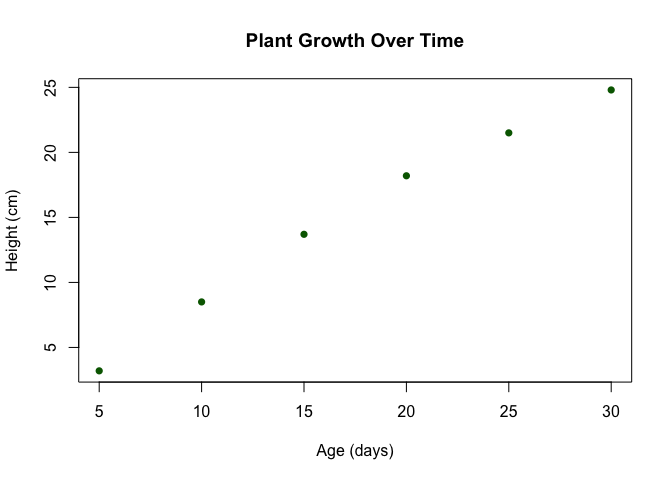

Basic_r
================
Puttipon
2025-05-02

การคำนวณใน R

``` r
1 + 1
```

    ## [1] 2

``` r
2*2
```

    ## [1] 4

``` r
2/3
```

    ## [1] 0.6666667

``` r
human_height <- 10.5
leaf_count <- 25
```

``` r
human_height * 2
```

    ## [1] 21

กด option+command+i (สร้างกล่องข้อความ),พิม C แล้วมีวงเล็บเพื่อใส่ข้อมูลเป็นชุด

``` r
# การสร้างตัวแปรคือ <- ตามด้วยข้ออมูล
human_height <- c(10.5, 20.5, 12.5, 8.5)
human_height * 10
```

    ## [1] 105 205 125  85

``` r
human_height * leaf_count
```

    ## [1] 262.5 512.5 312.5 212.5

``` r
human_height_2 <- c(200, 300, 500, 1000)
human_height+human_height_2
```

    ## [1]  210.5  320.5  512.5 1008.5

``` r
human_height*human_height_2
```

    ## [1] 2100 6150 6250 8500

``` r
human_height_2*100
```

    ## [1] 2e+04 3e+04 5e+04 1e+05

``` r
human_height_2 + 10
```

    ## [1]  210  310  510 1010

``` r
human_height_2 - human_height
```

    ## [1] 189.5 279.5 487.5 991.5

เปลี่ยนค่าตัวแปร

``` r
human_height_2 <- human_height_2 * 2
```

Data Type ใส่class ตามด้วยวงเล็บและข้อความ คือการเช็คประเภท Data

``` r
weight <- 2.5
class (weight)
```

    ## [1] "numeric"

``` r
class (human_height)
```

    ## [1] "numeric"

``` r
# Integer >> L คือเป็นจำนวนเต็ม
count <- 10L  
class (count)
```

    ## [1] "integer"

``` r
count + 20
```

    ## [1] 30

``` r
# character >> คือข้อความ โดยการใส่ " "
count <- "10L"
class (count)
```

    ## [1] "character"

``` r
# logical >> ใส่ True or false
is_flowring <- "TRUE"
class (is_flowring)
```

    ## [1] "character"

``` r
class (is_flowring)
```

    ## [1] "character"

``` r
"สร้าง vector ที่เป็นตัวเลข"
```

    ## [1] "สร้าง vector ที่เป็นตัวเลข"

``` r
height <- c(10.2, 15.7, 12.3, 9.8, 11.5)
```

``` r
# สร้าง vector of species names
species <- c("Arabidopsis", "Nicotiana", "Oryza", "Zea", "Solanum")
species
```

    ## [1] "Arabidopsis" "Nicotiana"   "Oryza"       "Zea"         "Solanum"

``` r
# การใส่ [ ] ตามด้วยเลข คือ การบอกว่าข้อมูลตำแหน่งที่นั้นคืออะไร
# ถ้าใส่ : คือ เอาข้อมูลที่ต้องการเรียงกันอยู่ แต่ถ้าต้องการเลือกบางอันให้ใช้ ,
height[3]
```

    ## [1] 12.3

``` r
height [2:3]
```

    ## [1] 15.7 12.3

``` r
height[c(2,4)]
```

    ## [1] 15.7  9.8

``` r
# ลองทำกับข้อมูล charactor ดูบ้าง
species[2:4]
```

    ## [1] "Nicotiana" "Oryza"     "Zea"

``` r
species[c(2,4)]
```

    ## [1] "Nicotiana" "Zea"

``` r
# การใส่คำสั่งให้ Data
# เช่น ค่าเฉลี่ย  ค่ากลาง ค่า sum ค่า length คือจำนวนสมาชิก
mean(height)
```

    ## [1] 11.9

``` r
median(height)
```

    ## [1] 11.5

``` r
min(height)
```

    ## [1] 9.8

``` r
max(height)
```

    ## [1] 15.7

``` r
sum(height)
```

    ## [1] 59.5

``` r
length(height)
```

    ## [1] 5

``` r
#factor คือ vector ที่มีชื่อ
treatments <- factor(c("Control", "Treatment A", "Treatment B", "Control", "Treatment A"))
treatments
```

    ## [1] Control     Treatment A Treatment B Control     Treatment A
    ## Levels: Control Treatment A Treatment B

``` r
treatments_2 <- c("contro", "treatment A", "Treatment B", "control", "treatment A")
# vector ประกอบด้วย factor คือการจัดกลุ่มเฉยๆ แต่ถ้าจัดกลุ่มแล้วมีความหมายคือ order
```

``` r
# level ใช้เช็คว่ามีกี่กลุ่ม
levels(treatments)
```

    ## [1] "Control"     "Treatment A" "Treatment B"

``` r
# table ใช้เช็คว่าแต่ละกลุ่มมีจำนวนเท่าไร
table(treatments)
```

    ## treatments
    ##     Control Treatment A Treatment B 
    ##           2           2           1

``` r
# ทดลองใส่เกรด
grade_vector <- c("A", "B", "F", "F", "F", "C", "C")
grade_1 <- factor (grade_vector)

grade_2 <- factor (grade_vector, levels = c("A", "B", "C", "D", "F"))
                   
table(grade_1)                   
```

    ## grade_1
    ## A B C F 
    ## 1 1 2 3

``` r
# data.frame คือตาราง โดยที่คอลัมเดียวกันคือข้อมูลชนิดเดียวกันเท่านั้น ส่วนต่างคอลัมคือข้อมูลคนละชนิดได้
# ข้อมูลในตารางต้องเป็นตัวเลขหรือตัวอักษรเท่านั้น
# ขั้นตอนการทำ 1. สร้าง ข้อมูล ในตารางโดยใช้ <-
# (experiment คือชื่อ), data.frame คือ ฟังก์ชันสร้างตาราง
experiment <- data.frame(
# 2. คอลัมแรก สร้างลำดับ 1-5 โดยใช้ 1:5 หรือ ใช้ c(1,2,3,4,5)ก็ได้ (ใส่ชื่อคอลัมแรก Plant_ID)
  Plant_ID = 1:5,
# 3. คอลัมที่ 2 : ชื่อสปีชีส์ (ต้องมีจำนวนเท่ากับคอลัมแรก)
  Species = c("Arabidopsis", "Arabidopsis", "Nicotiana", "Nicotiana", "Oryza"),
# 4. คอลัมที่ 3 : ใส่ชื่อทรีทเม้น
  Treatment = c("Control", "Drought", "Control", "Drought", "Control"),
# 5. คอลัมที่ 4 : ใส่ข้อมูลความสูงของพืช
  Height = c(10.2, 8.7, 15.3, 12.8, 25.4),
# 6. คอลัมที่ 5 : ใส่ข้อมูลจำนวนใบพิืช
  Leaf_Count = c(8, 6, 12, 9, 7)
)
```

``` r
# ใส่เครื่องหมาย $ เพื่อเลือกแสดงคอลัมที่ต้องการ
experiment$Plant_ID
```

    ## [1] 1 2 3 4 5

``` r
experiment$Species
```

    ## [1] "Arabidopsis" "Arabidopsis" "Nicotiana"   "Nicotiana"   "Oryza"

``` r
tmp<-experiment$Plant_ID
# เอา tmp ใส่ใน plant_ID
experiment$Plant_ID<-tmp
# แก้ข้อมูลในคอลัมโดยบวก 5
tmp<-tmp+5
# กดแสดงตาราง
experiment
```

    ##   Plant_ID     Species Treatment Height Leaf_Count
    ## 1        1 Arabidopsis   Control   10.2          8
    ## 2        2 Arabidopsis   Drought    8.7          6
    ## 3        3   Nicotiana   Control   15.3         12
    ## 4        4   Nicotiana   Drought   12.8          9
    ## 5        5       Oryza   Control   25.4          7

``` r
# แก้ไขกลับเหมือนเดิม
experiment$Plant_ID<-c(1,2,3,4,5)
experiment
```

    ##   Plant_ID     Species Treatment Height Leaf_Count
    ## 1        1 Arabidopsis   Control   10.2          8
    ## 2        2 Arabidopsis   Drought    8.7          6
    ## 3        3   Nicotiana   Control   15.3         12
    ## 4        4   Nicotiana   Drought   12.8          9
    ## 5        5       Oryza   Control   25.4          7

``` r
experiment[2:4,2:3]
```

    ##       Species Treatment
    ## 2 Arabidopsis   Drought
    ## 3   Nicotiana   Control
    ## 4   Nicotiana   Drought

``` r
experiment[2,3]
```

    ## [1] "Drought"

``` r
experiment[2:3]
```

    ##       Species Treatment
    ## 1 Arabidopsis   Control
    ## 2 Arabidopsis   Drought
    ## 3   Nicotiana   Control
    ## 4   Nicotiana   Drought
    ## 5       Oryza   Control

``` r
summary(experiment)
```

    ##     Plant_ID   Species           Treatment             Height     
    ##  Min.   :1   Length:5           Length:5           Min.   : 8.70  
    ##  1st Qu.:2   Class :character   Class :character   1st Qu.:10.20  
    ##  Median :3   Mode  :character   Mode  :character   Median :12.80  
    ##  Mean   :3                                         Mean   :14.48  
    ##  3rd Qu.:4                                         3rd Qu.:15.30  
    ##  Max.   :5                                         Max.   :25.40  
    ##    Leaf_Count  
    ##  Min.   : 6.0  
    ##  1st Qu.: 7.0  
    ##  Median : 8.0  
    ##  Mean   : 8.4  
    ##  3rd Qu.: 9.0  
    ##  Max.   :12.0

``` r
experiment[1:3, c("Species", "Height")]
```

    ##       Species Height
    ## 1 Arabidopsis   10.2
    ## 2 Arabidopsis    8.7
    ## 3   Nicotiana   15.3

``` r
# Create a list containing different types of data
plant_data <- list(
  id <- "AT001",
  species <- "Arabidopsis thaliana",
  heights <- c(10.2, 11.5, 9.8),
  is_model_organism <- TRUE,
  germination_rates <- data.frame(
    temperature = c(20, 25, 30),
    rate = c(0.82, 0.95, 0.78)
  ) )
plant_data <- list(id_1 = id, 
              species_1 = species, 
              heights_1= heights, 
              is_modelorganism_1 = is_model_organism, 
              germination_rates_1 = germination_rates) 

plant_data$germination_rates_1
```

    ##   temperature rate
    ## 1          20 0.82
    ## 2          25 0.95
    ## 3          30 0.78

การสร้างกราฟ

``` r
# ใส่ข้อมูลเข้าไป
plant_age <- c(5, 10, 15, 20, 25, 30)
plant_size <- c(3.2, 8.5, 13.7, 18.2, 21.5, 24.8)

# ใส่ข้อมูลการ plot กราฟ และใส่สื่อกราฟ
plot(plant_age, plant_size, 
     main = "Plant Growth Over Time",
# กำหนดแกน x y
     xlab = "Age (days)",
     ylab = "Height (cm)",
# ใส่สี
     col = "darkgreen",
     pch = 16)
```

<!-- -->

ลองดึงข้อมูลจาก data frame ก่อนๆ

``` r
plot(experiment$Height, experiment$Leaf_Count, 
     main = "Teacher Puttipon",
     xlab = "Height (cm)",
     ylab = "Number",
     col = "pink",
     pch = 16)  
```

<!-- -->

การทำ Bar plots

``` r
# Create a bar plot
barplot(experiment$Leaf_Count, 
        names.arg = experiment$Treatment,
        main = "Ford Sut Lore",
        xlab = "Species",
        ylab = "Count",
        col = "red",
        border = "blue")
```

<!-- -->

``` r
# ลองทำว่าแต่ละสปีชีส์มีกี่ตัวอย่าง
table(experiment$Species)
```

    ## 
    ## Arabidopsis   Nicotiana       Oryza 
    ##           2           2           1

``` r
tmp<-table(experiment$Species)
names(tmp)
```

    ## [1] "Arabidopsis" "Nicotiana"   "Oryza"

``` r
barplot(tmp,  
        names.arg = names(tmp),
        main = "Ford Sut Lore",
        xlab = "Species",
        ylab = "Count",
        col = "red",
        border = "blue")
```

<!-- -->

``` r
table(experiment$Treatment)
```

    ## 
    ## Control Drought 
    ##       3       2

``` r
tmp<-table(experiment$Treatment)
names(tmp)
```

    ## [1] "Control" "Drought"

``` r
barplot(tmp,  
        names.arg = names(tmp),
        main = "Ford Sut Lore",
        xlab = "Treatment",
        ylab = "Count",
        col = "green",
        border = "blue")
```

<!-- -->

การทำ Box plots

``` r
# Create some data
treatment_A <- c(12.3, 14.5, 13.8, 15.2, 11.9, 13.7)
treatment_B <- c(15.8, 16.2, 14.9, 17.3, 16.5, 15.9)
treatment_C <- c(10.2, 11.5, 9.8, 10.5, 12.1, 11.3)

# Combine data for boxplot
all_data <- list(
  "Control" = treatment_A,
  "Fertilizer" = treatment_B,
  "Drought" = treatment_C
)

# Create a boxplot
boxplot(all_data,
        main = "Plant Heights by Treatment",
        ylab = "Height (cm)",
        col = c("lightblue", "lightgreen", "salmon"))
```

<!-- -->

``` r
dat2<-data.frame(Control = treatment_A,
                 Fertilizer = treatment_B,
                 Drough = treatment_C)
boxplot(dat2,
        main = "Plant Heights by Treatment",
        ylab = "Height (cm)",
        col = c("lightblue", "lightgreen", "salmon"))
```

<!-- -->

ทำ T-test

``` r
# เอาค่าจากที่เคยทำมาใช้
dat2 
```

    ##   Control Fertilizer Drough
    ## 1    12.3       15.8   10.2
    ## 2    14.5       16.2   11.5
    ## 3    13.8       14.9    9.8
    ## 4    15.2       17.3   10.5
    ## 5    11.9       16.5   12.1
    ## 6    13.7       15.9   11.3

``` r
# Perform a t-test
t_test_result <- t.test(dat2$Fertilizer, dat2$Control)

# View the result
t_test_result
```

    ## 
    ##  Welch Two Sample t-test
    ## 
    ## data:  dat2$Fertilizer and dat2$Control
    ## t = 4.1511, df = 8.4347, p-value = 0.002855
    ## alternative hypothesis: true difference in means is not equal to 0
    ## 95 percent confidence interval:
    ##  1.138545 3.928121
    ## sample estimates:
    ## mean of x mean of y 
    ##  16.10000  13.56667

การทำ ANOVA

``` r
dat2
```

    ##   Control Fertilizer Drough
    ## 1    12.3       15.8   10.2
    ## 2    14.5       16.2   11.5
    ## 3    13.8       14.9    9.8
    ## 4    15.2       17.3   10.5
    ## 5    11.9       16.5   12.1
    ## 6    13.7       15.9   11.3

``` r
# Combine data into a single data frame
plant_growth <- data.frame(
  Height = c(dat2$Control, dat2$Fertilizer, dat2$Drough),
  Treatment = factor(
    rep(c("Control", "Fertilizer", "Drough"), each = 6))
)
plant_growth   
```

    ##    Height  Treatment
    ## 1    12.3    Control
    ## 2    14.5    Control
    ## 3    13.8    Control
    ## 4    15.2    Control
    ## 5    11.9    Control
    ## 6    13.7    Control
    ## 7    15.8 Fertilizer
    ## 8    16.2 Fertilizer
    ## 9    14.9 Fertilizer
    ## 10   17.3 Fertilizer
    ## 11   16.5 Fertilizer
    ## 12   15.9 Fertilizer
    ## 13   10.2     Drough
    ## 14   11.5     Drough
    ## 15    9.8     Drough
    ## 16   10.5     Drough
    ## 17   12.1     Drough
    ## 18   11.3     Drough

``` r
# Perform one-way ANOVA
anova_result <- aov(Height ~ Treatment, data = plant_growth)

# Summary of the ANOVA results
summary(anova_result)
```

    ##             Df Sum Sq Mean Sq F value   Pr(>F)    
    ## Treatment    2  81.14   40.57   40.59 8.87e-07 ***
    ## Residuals   15  14.99    1.00                     
    ## ---
    ## Signif. codes:  0 '***' 0.001 '**' 0.01 '*' 0.05 '.' 0.1 ' ' 1

``` r
# If the ANOVA is significant, perform post-hoc test to find which groups differ
# Tukey's Honest Significant Difference test
tukey_result <- TukeyHSD(anova_result)
tukey_result
```

    ##   Tukey multiple comparisons of means
    ##     95% family-wise confidence level
    ## 
    ## Fit: aov(formula = Height ~ Treatment, data = plant_growth)
    ## 
    ## $Treatment
    ##                         diff       lwr       upr     p adj
    ## Drough-Control     -2.666667 -4.165984 -1.167350 0.0009157
    ## Fertilizer-Control  2.533333  1.034016  4.032650 0.0014425
    ## Fertilizer-Drough   5.200000  3.700683  6.699317 0.0000006
